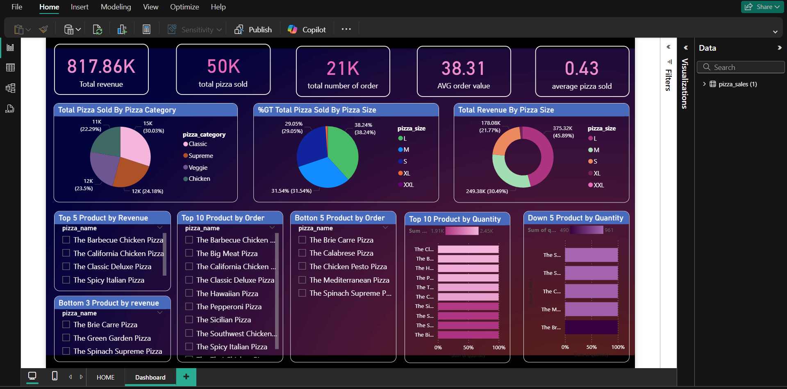

# Pizza Hut Sales Analysis – Power BI

## 📊 Project Overview
This project analyzes monthly Pizza Hut sales, visualizing KPIs like total revenue, top-selling items, customer count, etc.

## 🛠 Tools Used
- Power BI Desktop
- DAX
- Power Query

## 📁 File Info
- `Pizza Hut Sale Analysis.pbix`: Main dashboard file
- `Home page.png , Dashboard page.png`: 📸 Dashboard preview

## 📸 Dashboard Preview

⚠️ Note: `.pbix` files cannot be viewed directly on GitHub. Download and open in Power BI Desktop to explore the report.
